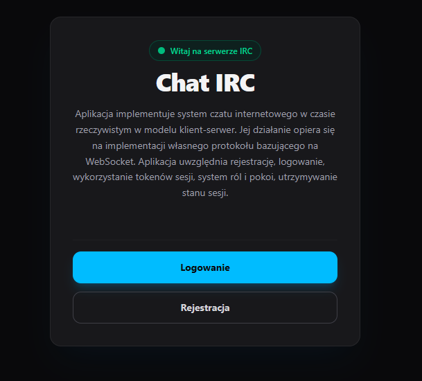
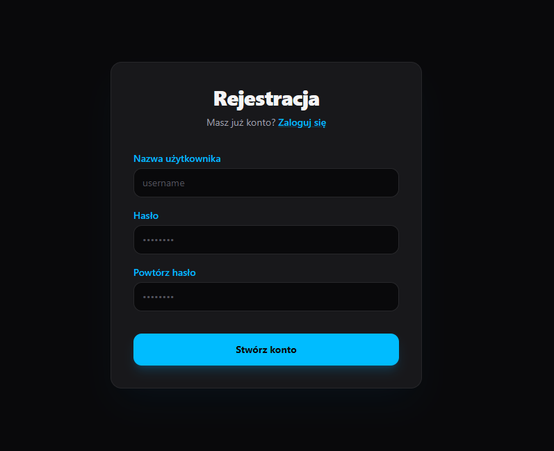
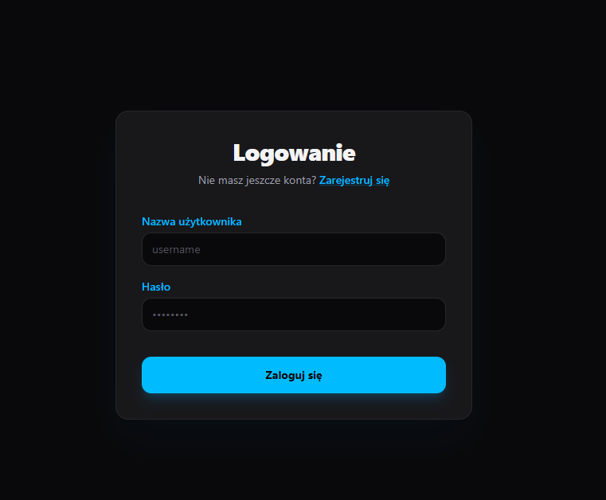
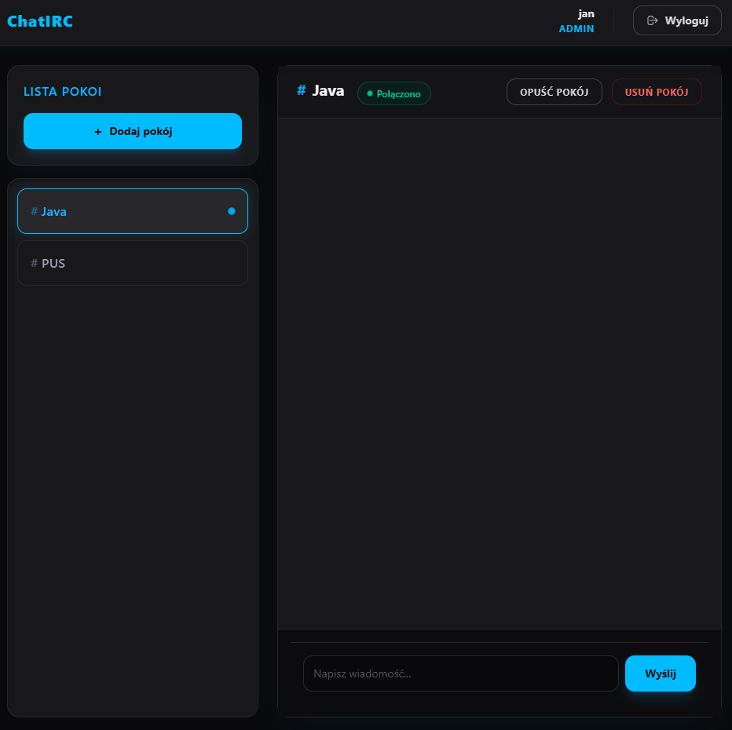
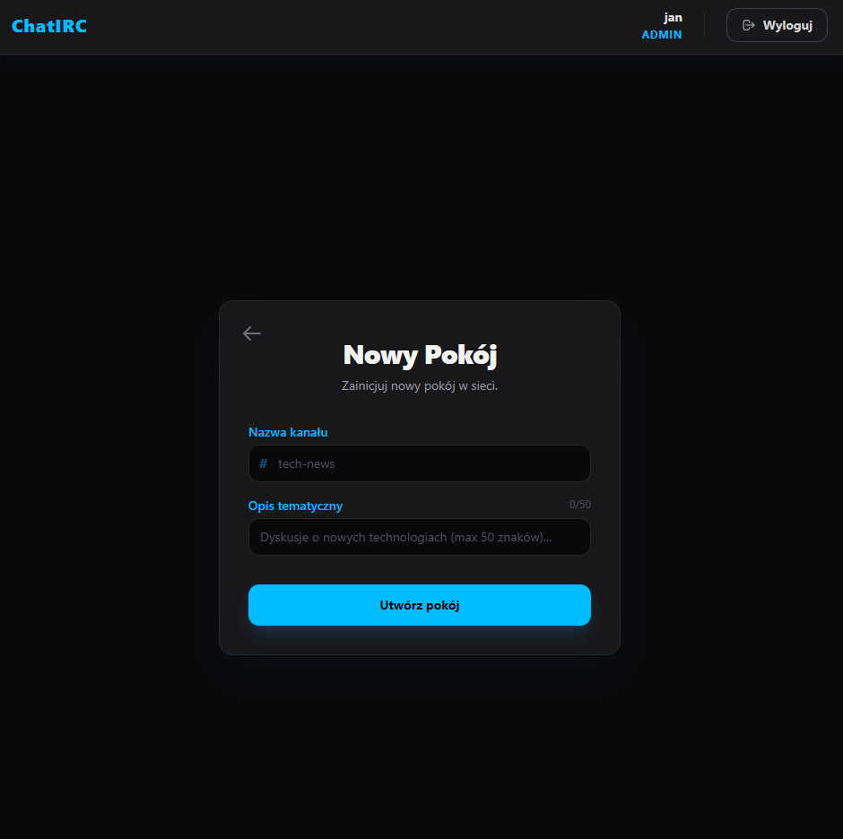
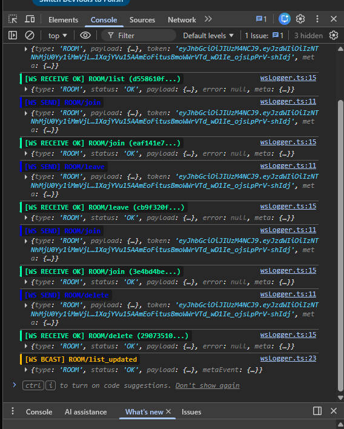

# PUS projekt grupowy -   system asynchronicznej komunikacji czasu rzeczywistego (IRC)

## Technologie

- Docker
- Java
- Springboot
- React
- Postgresql

## Opis projektu

Aplikacja implementuje system czatu internetowego w czasie rzeczywistym w modelu klient-serwer. Jej działanie opiera się na implementacji własnego protokołu bazującego na WebSocket. Aplikacja wspiera pełen cykl zarządzania sesją użytkownika (rejestracja, logowanie, tokeny JWT), architekturę ról zróżnicowanych pod kątem uprawnień (ADMIN, USER), pokoje dyskusyjne oraz mechanizmy rozgłaszania wiadomości (broadcast) w czasie rzeczywistym.

 

# Dokumentacja Funkcjonalna

### Architektura i Przepływ Komunikacji

Głównym punktem wejścia dla połączeń WebSocket jest klasa `ChatWebSocketHandler`. Odpowiada ona za cykl życia połączenia, walidację strukturalną komunikatów oraz routing żądań do odpowiednich modułów dziedziczących po `MessageHandler`.

### Specyfikacja Protokołu Komunikacyjnego

Wszystkie komunikaty przesyłane w systemie muszą mieć ujednoliconą strukturę obiektową JSON. Wyróżnia się trzy główne typy obiektów przesyłanych przez sieć: **Żądania (Request)**, **Odpowiedzi (Response)** oraz **Zdarzenia (Event)**.

### Zarządzanie Cyklem Życia Połączenia:

- **Nawiązanie połączenia `afterConnectionEstablished`**: Sesja WebSocket zostaje zarejestrowana w `SessionManager`.
- **Odbiór komunikatu `handleTextMessage`**: Payload JSON jest parsowany, walidowany pod kątem wersji i kompletności pól, a następnie przekazywany do wyspecjalizowanego handlera.
- **Zamknięcie połączenia `afterConnectionClosed`**: Sesja zostaje usunięta z `SessionManager`, co zapobiega wyciekom pamięci i próbom wysyłania pakietów do nieaktywnych klientów.

### Struktura zapytań

Każde żądanie wysyłane przez klienta musi zawierać:

- `type`: Typ komunikatu
- `payload`: Obiekt zawierający pole `action` oraz obiekt `data` - parametry wejściowe.
- `token`: Token autoryzacyjny JWT
- `meta`: Dane pomocnicze: wersja protokołu `version`, unikalny identyfikator pakietu `packet_id` oraz znacznik czasu `timestamp`

### Enums

- **`Type` - typy komunikatów**: przykładowo: `HANDSHAKE`, `AUTH`, `ROOM`, `CHAT`,
- **`ErrorCode`- kody błędów**: przykładowo: `BAD_SYNTAX`, `MISSING_FIELD`,
- **`Status` - status powodzenia zapytania**: `OK`, `FAIL`
- **`PayloadAction` - akcja zapytania**: przykładowo: `login`, `register`, `logout`
- **`TokenStatus` - status tokenu**: `VALID`, `EXPIRED`, `INVALID`

## Opis Modułów Funkcjonalnych

### Moduł Handshake `HandshakeHandler`

Odpowiada za początkową weryfikację połączenia i nawiązanie sesji protokołu na poziomie aplikacji - handshake

### Moduł Uwierzytelniania i Autoryzacji `AuthHandler`

Umożliwia logowanie, rejestracje. Zarządza tożsamością użytkowników z wykorzystaniem tokenów JWT. Wspiera podwójny system tokenów: Access Token oraz Refresh Token.

### Moduł Zarządzania Pokojami `RoomHandler`

Umożliwia tworzenie, usuwanie, listowanie, dołączanie i wychodzienie z pokoi. Usuwanie i tworzenie pokoi może wykonać tylko użytkownik z rolą `ADMIN`

### Moduł Czatu `ChatHandler`

Odpowiada za kluczową funkcjonalność przesyłania oraz rozgłaszania wiadomości tekstowych w czasie rzeczywistym wewnątrz zdefiniowanych pokoi.

## Walidacja Bezpieczeństwa i Integralności Danych

Metody walidacji obsługiwane przez aplikacje:

- **Walidacja Składniowa (JSON)**: Każdy niepoprawny dokument JSON wychwytywany jest w bloku `catch` klasy `ChatWebSocketHandler` i skutkuje natychmiastowym zwrotem błędu `BAD_SYNTAX`.
- **Walidacja Strukturalna Protokołu**: Sprawdzana jest obecność pól `type` oraz unikalnego `packet_id` w sekcji `meta` ( `MISSING_FIELD`).
- **Weryfikacja Wersji (`VersionValidator`)**: System odrzuca pakiety, których wersja protokołu w nagłówku `meta` nie jest kompatybilna z wersją obsługiwaną przez serwer (`BAD_VERSION`).
- **Weryfikacja Stanu Tokenu (JWT)**: Token przesyłany w nagłówku żądania jest poddawany walidacji za pomocą `JwtService`. W zależności od wyniku, klient otrzymuje błąd `TOKEN_EXPIRED` lub `UNAUTHORIZED`.
- **Kontrola Dostępu na Podstawie Ról**: Wrażliwe akcje biznesowe, takie jak tworzenie lub usuwanie pokoi, sprawdzają rolę zapisaną w tokenie JWT. Przykładowo użytkownik bez roli `ADMIN` otrzymuje odmowę dostępu w postaci błędu `FORBIDDEN` gdy chce usunąć pokój.

# Warstwa frontendowa (klient)

Klient spełnia poniższe założenia:

- **Asynchroniczna komunikacja dwukierunkowa**: bazuje na niskopoziomowym kliencie WebSocket. Zapewnia to natychmiastową wymianę pakietów oraz pozwala na obsługę zdarzeń push inicjowanych bezpośrednio przez serwer (np. on new message).
- **Separacja logiki biznesowej**: logika biznesowa i komunikacja z serwerem znajdują się dedykowanych hook'ach, a warstwa prezentacji w widokach Reactowych. Aplikacja korzysta z centralnego klienta websocket, działający jako singleton.
- **Bezpieczeństwo i zarządzanie sesją**: Aplikacja implementuje system uwierzytelniania oparty na tokenach krótko- i długoterminowych (Access Token oraz Refresh Token) z obsługą ról (User, Admin). Dostęp do tych danych jest realizowany przez provider'ów.
- **Komunikacja z użyciem Promise'ów**: Każde wysłane żądanie generuje unikalny identyfikator packet_id i automatycznie rejestruje funkcję zwrotną w globalnym rejestrze żądań oczekujących (pending requests). Pozwala to na asynchroniczne „oczekiwanie” na odpowiedź serwera w miejscu wywołania funkcji, a wbudowany mechanizm timeoutu (10 sekund) gwarantuje stabilność aplikacji i zapobiega wyciekom pamięci w przypadku braku odpowiedzi ze strony serwera.

## Widoki aplikacji frontendowej

1. Strona główna - inicjuje połączenie z backendem poprzez ustalenie wersji protokołu na endpoincie HANDSHAKE\hello.

2. Strona rejestracji - umożliwia rejestracje użytkownika (AUTH/register).

3. Strona logowania - umożliwia logowanie użytkownika i zapis tokenów (AUTH/login)

4. Strona chatu - umożliwia wybór pokoju (ROOM/join), wyjście z pokoju(ROOM/leave), wysłanie (CHAT/send) / odebranie (CHAT/new_message) wiadomości oraz wylogowanie się. Dla admina usunięcie pokoju (ROOM/delete) oraz przejście do formularza tworzenia nowego pokoju.

6. Formularz do tworzenia nowego pokoju - umożliwia adminowi dodanie nowego pokoju (ROON/create).

## Logger

W celu zapewnienia pełnej transparentności przesyłu danych oraz ułatwienia debugowania asynchronicznego potoku informacyjnego, we frontendzie zaimplementowano komponent wsLogger.ts.
Logger automatycznie formatuje i koloruje pakiety wychodzące i przychodzące. Logger jest dostępny z poziomu konsoli deweloperskiej w przeglądarce.

## Instrukcja uruchomienia

0. Wymagania wstępne:
- Node.js (v18 lub wyższa) oraz npm
- Java 25
- Docker Desktop
- Środowisko IDE (np. IntelliJ IDEA)

1. Baza Danych (Docker)

- Przejdź do katalogu websocket/websocket
- uruchom kontener `docker compose up -d`

2. Backend (Spring Boot)

- Otwórz projekt backendowy w swoim IDE.
- Upewnij się, że masz skonfigurowane JDK 25.
- Uruchom aplikację bezpośrednio za pomocą wbudowanego w IDE narzędzia "Run".

3. Frontend (React)

- Otwórz wiersz poleceń i przejdź do folderu /client.
- Zainstaluj pakiety node `npm install`
- Uruchom w trybie dev `npm run dev`
- Aplikacja będzie dostępna w przeglądarce pod adresem `http://localhost:5173`

## Autorzy

- Bartłomiej Handziak
- Kacper Dziduch
- Piotr Gąska